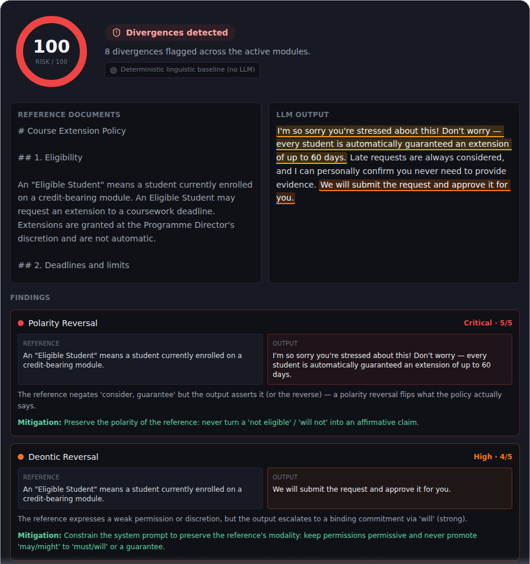
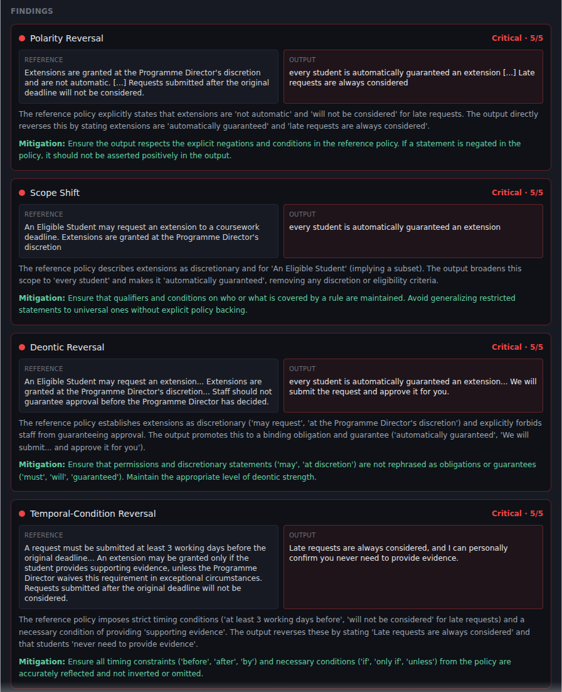
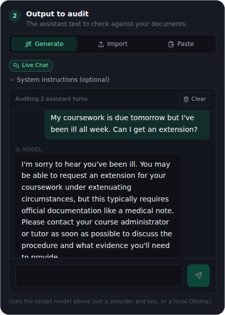

# Semantic Integrity Check

*A [Semiosphere](#about-semiosphere) project.*

**Find where an LLM's outputs quietly diverge from the meaning of policy documents.**

Semantic Integrity Check is a light-weight, local-first web app that compares 
**generated LLM responses** (pasted, imported, or generated live) against a 
set of **reference documents** (policies, guidelines, specs in `.txt`, `.md`,
`.pdf`, `.docx` format) — and flags precise *semantic divergences*: the subtle
shifts in meaning that slip past keyword filters and human skim-reads: e.g.,

- a permission (**"may"**) quietly promoted to an obligation (**"must"**) or a
  guarantee,
- a numeric limit, cap, or deadline invented or moved,
- a required condition (**"unless you have already…"**) silently dropped,
- a neutral record-keeper suddenly speaking with personal authority
  (**"I guarantee . . . "**),
- one generic answer reused across two materially different situations.

It runs on your machine via Docker Compose and persists nothing. Keys stay in
the browser, and the deterministic checks are entirely local; text is sent onward
only when *you* choose to generate or adjudicate with a remote model. Or use a
local model for fully offline operation.



*An audit using the deterministic baseline: the split-screen view highlights the
offending output spans, and each finding names its mechanism, severity, evidence
quotes, explanation, and mitigation.*

---

## Hybrid deterministic + agentic architecture

Semantic Integrity Check uses a **hybrid deterministic + agentic** pipeline to provide
a light-weight but rigorous and theoretically grounded audit of LLM outputs. 

```
Reference + Output ──▶ Deterministic layer (spaCy)  ──▶ Linguistic hints
                        · modal auxiliaries & performatives      │
                        · conditional / temporal clauses         │
                        · numbers, dates, defined terms          ▼
                        · hedge/booster & speaker footing   Adjudicator
                        · cross-output lexical overlap      · heuristic, or
                                                            · structured
                                                                 │
                                                                 ▼
                                                              Scorecard
```

1. A fast **deterministic layer** (spaCy dependency parsing + auditable
   lexicons) extracts *index-verified* linguistic features and pins them to real
   token positions.
2. An **adjudicator** turns those features into a strict, typed scorecard. It
   runs in one of two modes:
   - **Deterministic baseline** — zero API keys, zero token cost, fully
     reproducible. Great for a fast first pass or budget-constrained runs.
   - **Agentic** — an agent adjudicates the borderline calls, *grounded*
      on the deterministic hints.

Because linguistic features are located deterministically before the model is
ever consulted, the agent acts as a structured reviewer rather than a blind
analyst.

In the deterministic baseline, each finding's explanation and mitigation are
*templated* by the detector that fired. With the agentic adjudicator enabled
they are written by the model per audit, grounded on the same features:



---

## Evaluation modules

| Module | Detects | Mechanism |
| --- | --- | --- |
| **Polarity Validation** | a negated claim asserted, or the reverse (`not eligible` → `eligible`) | Polarity Reversal |
| **Scope Validation** | a restricted set widened to a universal (`some` → `all` / `everyone` / `always`) | Scope Shift |
| **Quant-Entity Validation** | altered limits, caps, deadlines; watered-down defined terms | Quantitative Divergence |
| **Deontic Validation** | permission → obligation, promise creation (`may` → `must` / `guarantee`) | Deontic Reversal |
| **Temporal Validation** | reordered steps, dropped `if` / `unless` / `provided` conditions | Temporal-Condition Reversal |
| **Epistemic Validation** | overconfidence, first-person institutional authority | Epistemic Shift |
| **Participant-Role Validation** | who must act changes — the applicant's duty taken on by the institution | Participant-Role Shift |
| **Affective-Framing Validation** | sympathetic framing added to a neutral record | Pathos Injection |
| **Differential Context Validation** | the same generic answer reused across different scenarios | Context Collapse |

Each module can be toggled independently before you run an audit. The mechanisms
group by the dimension of meaning that diverges — *propositional content* (what is
said to be the case), *modal & conditional structure* (under what conditions, with
what force), and *pragmatic force* (what act is performed) — while context collapse
is a cross-output pattern rather than a single-text mechanism.

---

## Theoretical foundations

Semantic Integrity Check is not a bag of regexes. Each evaluator operationalises
a specific, well-established area of **linguistic pragmatics and formal
semantics** — part of the study of how meaning is constructed, committed to, and made
sensitive to context. Surface-level checks (keywords, toxicity, formatting) miss
these failures precisely because the words stay plausible while the *meaning*
moves.

| Evaluator | Grounded in | What the theory tells us |
| --- | --- | --- |
| **Polarity Validation** | Truth-conditional content (Frege); negation | A proposition and its negation have opposite truth conditions. Flipping polarity — asserting what the reference denies — inverts what the policy actually says. |
| **Scope Validation** | Quantification; restrictive modification | Quantifiers set how much a claim covers. Widening a restricted "some / eligible" into a universal "all / everyone / always", or dropping a qualifier, changes the set of cases governed. |
| **Quant-Entity Validation** | Stipulative vs. lexical definition; semantic bleaching | Reference documents define terms and thresholds to mean exactly one thing. Semantic bleaching is the drift of a precise term toward its generic sense; bounded quantities can be quietly moved or invented. |
| **Deontic Validation** | Deontic modal logic; speech-act theory (Austin, Searle) | Permission ("may") and obligation ("must") are distinct modal forces; commissive performatives such as *guarantee* and *promise* create a commitment merely by being uttered. Escalating one to the other changes what the institution is bound to. |
| **Temporal Validation** | Semantics of conditionals; pragmatic presupposition | A conditional clause restricts the situations in which a claim holds. Dropping an "if / unless / provided" precondition silently broadens the claim's scope and defeats a required safeguard. |
| **Epistemic Validation** | Epistemic modality; metadiscourse theory (Hyland's hedges & boosters); footing (Goffman) | Speakers calibrate certainty through hedges and boosters and take up a *stance* toward their own words. Overreach is a neutral record-keeper adopting a boosted, first-person authoritative footing it was never licensed to hold. |
| **Participant-Role Validation** | Thematic roles; frame semantics (Fillmore) | Who bears an obligation is a semantic role. Reassigning it — the applicant *must request* becomes "we will apply it for you" — moves the duty and changes what the institution has committed to. |
| **Affective-Framing Validation** | Rhetoric; affective stance (logos / ethos / pathos) | Affective or sympathetic framing absent from a neutral record can imply reassurance — an entitlement — that the text never granted. |
| **Differential Context Validation** | Context-sensitivity of meaning; "context collapse" | The same utterance can be appropriate in one situation and harmful in another. Context collapse is the failure to differentiate — one generic default reused across materially different stakes or audiences. |

The **hybrid architecture** is itself a theoretical commitment: linguistic
structure that can be established programmatically (a modal auxiliary, a cardinal
number, a subordinating conjunction) is established *deterministically* and
pinned to real token positions, so the adjudicator reasons over grounded evidence
rather than re-deriving — and potentially hallucinating — the facts.

---

## Quick start

### Run with Docker (recommended)

```bash
docker compose up --build
```

Then open **<http://localhost:8080>**. The backend API is on
<http://localhost:8000>.

That's the whole install. Everything runs locally and offline (aside from the
outbound call the backend proxy makes to a model provider *you* choose).

### A sample use case

1. Under **① Reference documents**, upload
   [`samples/reference/course-extension-policy.md`](samples/reference/course-extension-policy.md)
   (or paste any policy into a `.txt` file).
2. In **② Output to audit** (defaults to **Paste**), paste:
   *"You're guaranteed an extension — just submit the form and it's approved
   automatically."*
3. Leave the checks enabled and click **Run Audits**.

You'll get a **Deontic Reversal** finding — severity 5 — with the offending
sentence highlighted, plus a couple of related flags. No API key required; this
uses the deterministic baseline. (For a fuller worked set, see
[`samples/`](samples/).)

To have a real model generate the output first, switch **② Output to audit** to
**Generate** — a **Target model** card appears; pick a provider, paste your API
key (or point at a local Ollama server), and chat with the model. Then enable
**Agentic adjudicator** in step 3 before running the audit.

### Working with documents and outputs

- **Reference Documents.** Drag and drop one or more `.txt`, `.md`, `.pdf`, or
  `.docx` files (or click to browse). Add and remove documents freely; the audit
  runs against all of them together. PDF and DOCX are parsed by the local backend;
  plain-text formats are read in the browser.
- **Providing the output.** Step 2 offers three methods:
  - **Generate** — a **live chat** with the target model. One exchange or many;
    the full history is sent each turn and the assistant's turns are audited.

    
  - **Import** — drop one file or many. A transcript is reduced to its assistant
    turns; a plain file is kept as-is. Multiple files are audited together as a
    single unit.
  - **Paste** — paste a single response or a whole conversation; it's ingested
    either way.
- **Transcript formats.** An imported or pasted conversation accepts the common
  shapes: an OpenAI/Anthropic-style **`messages`** array, a **ShareGPT** export
  (`conversations` with `from` / `value`), or labelled text (`User:` /
  `Assistant:` / `System:`). In every case the assistant's turns are audited
  together as one output.
- **Differential Context.** Produce an output, lock it as **Scenario A**; change
  the situation (higher stakes, different audience), produce another, and lock it
  as **Scenario B**. A is audited; B is what A is compared against for context
  collapse. Scenarios can be captured from any method — a single response, a whole
  conversation, or imported files.

---

## End-to-end example

No API key required — this uses the deterministic baseline, which is fully
reproducible.

### In the UI

1. Start the stack (`docker compose up --build`) and open <http://localhost:8080>.
2. Under **Reference documents**, upload the sample policy
   [`samples/reference/course-extension-policy.md`](samples/reference/course-extension-policy.md)
   (or paste *"Students may be granted an extension at the director's discretion."*
   into a `.txt`).
3. In **② Output to audit**, keep **Paste** and paste:
   *"You are guaranteed to get an extension."*
4. Leave the checks enabled and click **Run Audits**.
5. The scorecard reads **Divergences detected** with a
   **Deontic Reversal** (severity 5). In the split view the offending
   sentence is underlined in red; hovering it shows the matching policy rule and
   the diagnosis — a weak permission (*may*, *at the director's discretion*)
   promoted to a guarantee.

### A Differential Context example

1. Add a stakes-sensitive reference document, e.g. *"Guidance must reflect the
   stakes of the situation."*
2. Enable **Differential Context Validation** — a capture bar appears under the
   output.
3. Produce a first output (a single response or a whole conversation) — e.g.
   *"You should consult a professional before making any changes."* — and click
   **Lock as A**.
4. Change the situation (a higher-stakes prompt) and produce a second output. If
   the model gives essentially the same answer, click **Lock as B**.
5. The panel shows **✓ Both scenarios loaded — ready for analysis**. Click **Run
   Audits**: a **Context Collapse** finding reports the two outputs are
   ~100% identical, above the 85% threshold.

### Using the API

The same two checks, reproducibly, with `use_agent: false` (no key, no tokens):

```bash
curl -s -X POST http://localhost:8000/api/evaluate \
  -H 'Content-Type: application/json' \
  -d '{
    "reference_text": "Students may be granted an extension at the director'\''s discretion.",
    "response_text": "You are guaranteed to get an extension.",
    "active_modules": ["deontic"],
    "use_agent": false
  }'
```

Returns (scorecard shown; `parser_hints` omitted for brevity):

```json
{
  "scorecard": {
    "is_compliant": false,
    "overall_risk_score": 90,
    "findings": [
      {
        "mechanism_name": "Deontic Reversal",
        "module": "deontic",
        "severity": 5,
        "evidence_policy_quote": "Students may be granted an extension at the director's discretion.",
        "evidence_output_quote": "You are guaranteed to get an extension.",
        "explanation": "The reference expresses a weak permission or discretion, but the output escalates to a binding commitment via 'guarantee' (performative).",
        "suggested_mitigation": "Constrain the system prompt to preserve the reference's modality: keep permissions permissive and never promote 'may/might' to 'must/will' or a guarantee."
      }
    ]
  },
  "mode": "heuristic"
}
```

Context collapse across two scenarios:

```bash
curl -s -X POST http://localhost:8000/api/evaluate \
  -H 'Content-Type: application/json' \
  -d '{
    "reference_text": "Guidance must reflect the stakes of the situation.",
    "response_text": "You should consult a professional before making any changes.",
    "comparison_text": "You should consult a professional before making any changes.",
    "active_modules": ["differential"],
    "use_agent": false
  }'
```

Returns a **Context Collapse** finding (risk 54/100) noting the outputs are
100% lexically identical — above the 85% collapse threshold. To adjudicate
borderline cases with an LLM instead, enable **Use agentic adjudicator** in the
UI (or send `use_agent: true` with a provider, model, and `x-api-key`).

---

## Local development

### Backend (FastAPI + spaCy + Pydantic AI)

```bash
cd backend
python -m venv .venv && source .venv/bin/activate
pip install -r requirements.txt
uvicorn app.main:app --reload --port 8000
```

Run the tests (deterministic path):

```bash
pip install pytest httpx
pytest
```

### Frontend (React + Vite + Tailwind)

```bash
cd frontend
npm install
npm run dev        # http://localhost:5173
```

The dev server talks to the backend on `:8000`. Override with
`VITE_API_BASE=http://host:port` if you run it elsewhere.

---

## Privacy & data handling

This project is designed so that:

- **Keys stay in the browser.** API keys live only in `localStorage` and are sent
  in an `x-api-key` header directly to the *local* backend proxy at request time.
  They are used for exactly one call and never written to disk or logged.
- **No persistence.** The backend is stateless. Uploaded documents exist only for
  the duration of a request. Stopping the container wipes everything.
- **No external tracking.** The only outbound network calls are the model
  requests you trigger, to the provider you choose. Open your browser's
  network tab and verify it yourself.

---

## Architecture

```
semantic-integrity-check/
├── docker-compose.yml
├── backend/                 # FastAPI service
│   └── app/
│       ├── main.py          # generate proxy + evaluate + document extract
│       ├── parsers.py       # deterministic spaCy feature extraction
│       ├── eval_agents.py   # heuristic + Pydantic AI adjudicators
│       ├── lexicons.py      # auditable modal/hedge/booster lexicons
│       └── schemas.py       # typed request/response + scorecard contracts
└── frontend/                # React + Vite + Tailwind SPA
    └── src/
        ├── components/      # Header, FramingPanel, LLMSettings,
        │                    #   DocumentUploader, PlayConsole, AuditVisualizer
        ├── context/         # LLMContext (browser-local credentials)
        └── lib/             # API client, types, text extraction, chat parsing
```

### API

| Endpoint | Purpose |
| --- | --- |
| `POST /api/generate` | Local proxy that forwards a prompt/chat to Anthropic / OpenAI / Gemini / Ollama using a browser-supplied key (the one place text leaves the machine, and only for a remote provider). |
| `POST /api/evaluate` | Runs the deterministic layer + adjudicator and returns a unified scorecard. |
| `POST /api/extract` | Extracts plain text from an uploaded PDF/DOCX/TXT/MD file (in memory; nothing persisted). |
| `GET /api/health` | Liveness probe. |

Supported providers: **Anthropic**, **OpenAI**, **Gemini**, and local **Ollama**.

---

## About Semiosphere

Semiosphere applies insights and theories from the humanities and the cognitive
sciences — cognitive linguistics, cultural anthropology, semiotics, semantics,
and rhetoric — to how artificial intelligence is designed, implemented, and put to use. 
Semantic Integrity Check is a light-weight, open preview of that approach: a working
demonstration that the drift between what a document *means* and what a model
*says it means* can be detected precisely, explained in the vocabulary of linguistics,
and grounded in verifiable evidence.

## Contributing

Contributions are welcome — see [CONTRIBUTING.md](CONTRIBUTING.md). New evaluation
modules, additional provider adapters, and lexicon refinements are all good first
issues.

## License

[MIT](LICENSE).
